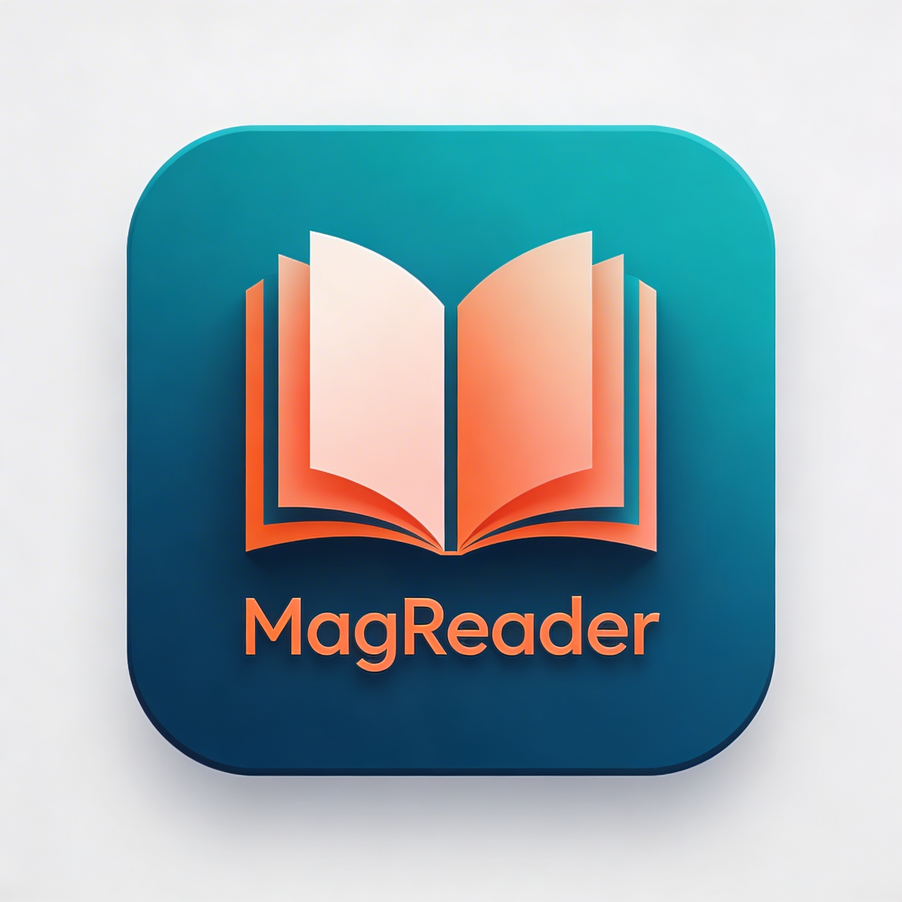
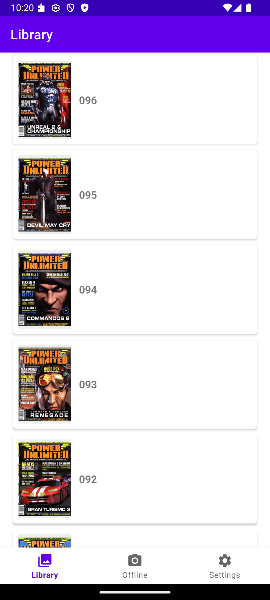
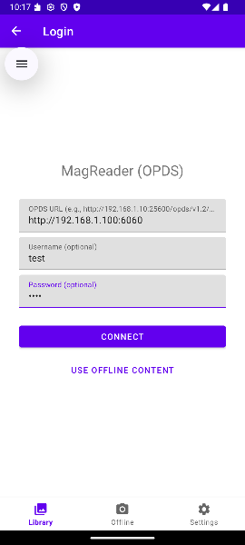
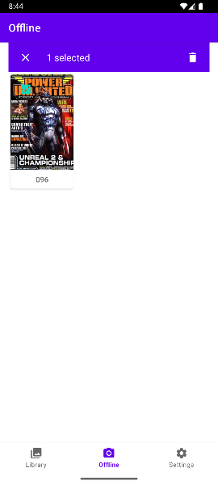
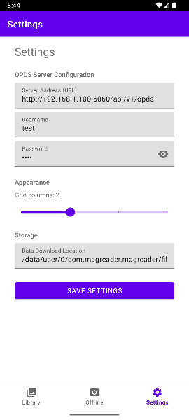

<p align="center">
  
</p>

# MagReader

MagReader is a modern Android application designed for browsing and reading magazines and books via OPDS feeds.

## Download

You can download the latest version of MagReader and stay updated by adding this repository to **Obtainium**.

**Direct Import:** [Add to Obtainium](https://apps.obtainium.imranr.dev/redirect?r=aHR0cHM6Ly9naXRodWIuY29tL3Nia2cwMDAyL01hZ1JlYWRlcgo=)

## Features

- **OPDS Library**: Browse your favorite catalogs using the OPDS protocol.
- **Integrated Reader**: Smooth reading experience for digital publications.
- **Offline Mode**: Access your downloaded content without an internet connection.
- **Modern UI**: Built with Jetpack components, Material Design, and responsive layouts.

## Screenshots

| Library | Login | Offline | Settings |
|:---:|:---:|:---:|:---:|
|  |  |  |  |

## Getting Started

### Prerequisites

- Android Studio Flamingo or newer
- JDK 17
- Android SDK 26+

### Build & Run

1. Clone the repository:
   ```bash
   git clone https://github.com/sbkg0002/MagReader.git
   ```
2. Open the project in Android Studio.
3. Build the project using Gradle:
   ```bash
   ./gradlew assembleDebug
   ```
